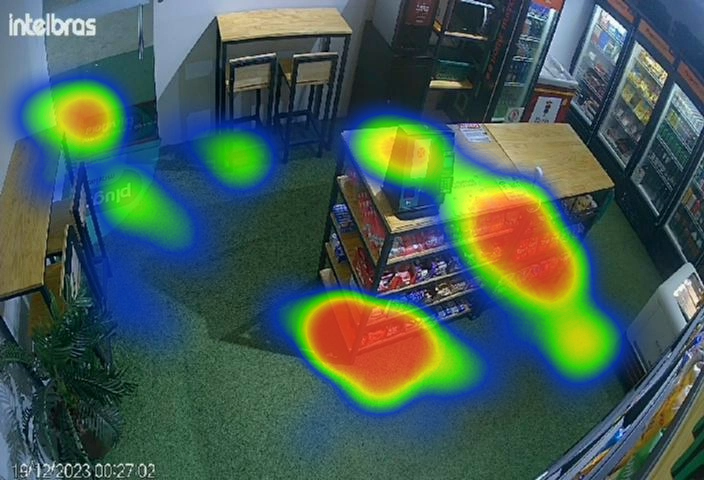

# 📍 Detection Heatmap API

API para geração de mapas de calor (heatmaps) a partir de detecções extraídas de um JSON e sobrepostas em uma imagem base.



### Entradas da API

- Entrada em JSON
- String do objeto de relevância. Ex: “person”
- URL de uma imagem

### Saída da API

- Imagem com Mapa de Calor em formato PNG. 

    Caso já exista, utilize a imagem gravada no disco ou se não existir criar novamente.
    Os pontos em que determinado objeto fica mais tempo ficam em vermelho e os que ficam menos tempo ficam em azuis. Assim é possível entender o comportamento de um local em relação a presença de pessoas ou outros objetos.


## 📦 Estrutura do Projeto

```
📦 detection-heatmap-api/
├── app/
│   ├── api/               # Endpoints da API
│   ├── core/              # Configurações e contratos (interfaces)
│   ├── services/          # Lógica de negócio: imagem, extração, heatmap
│   ├── utils/             # Utilitários genéricos
│   └── heatmap/           # Implementações de geradores de heatmap
├── main.py                # Inicialização da aplicação FastAPI
├── requirements.txt       # Dependências
├── Dockerfile             # Container da aplicação
├── docker-compose.yml     # Orquestração Docker
├── run.sh                 # Script para rodar local
├── test_request.json      # Exemplo de entrada JSON
├── test_api.py            # Teste simples com requests
└── README.md              # Documentação
```

## 🚀 Como Rodar a Aplicação

### 🔧 Pré-requisitos
- Docker e Docker Compose instalados

### ✅ Subindo com Docker Compose
```bash
docker-compose up --build
```
ou
```bash
sudo docker compose up --build
```
A API estará disponível em: [http://localhost:8000](http://localhost:8000)

### ✅ Rodando Localmente (sem Docker)
```bash
python3 -m venv venv
source venv/bin/activate
pip install -r requirements.txt
bash run.sh
```

## 🧪 Testando a API

### ▶️ Exemplo de Requisição com `curl`
```bash
curl -X POST http://localhost:8000/api/generate-heatmap \
  -H "Content-Type: application/json" \
  -d @[INSIRA AQUI O CAMINHO DO JSON COM OS ARGUMENTOS DE ENTRADA DA API]
```

### ▶️ Com Python (test_api.py)
```bash
python test_api.py
```

### Exemplo de Payload (`test_request.json`)
```json
{
  "data_json": {
    "deepstream-msg": [
      ["123|100.0|200.0|150.0|250.0|person|zone1"]
    ]
  },
  "object_wanted": "person",
  "url_image": "https://drive.google.com/file/d/1GXHYrpLb6nyO1tryCXrz2twNPqU3yH3B/view?usp=sharing"
}
```

## 🔄 Fluxo da Aplicação
1. Recebe JSON, nome do objeto, e URL da imagem via `POST /api/generate-heatmap`
2. Extrai as bounding boxes do objeto desejado
3. Calcula os centróides
4. Sobrepõe os pontos sobre a imagem como mapa de calor
5. Salva a imagem como `heatmap.png` e retorna o path

## 🧰 Tecnologias Utilizadas
- FastAPI
- Pillow (PIL)
- NumPy
- Matplotlib
- Seaborn
- Docker

## 📌 Observações
- O projeto assume que as URLs são do Google Drive estão no formato público com `file/d/<ID>`
- Cada mensagem dentro da lista de resultados do JSON vai conter um campo que indica os objetos detectados e sua posição, este campo é o "deepstream-msg". Esses dados devem seguir o modelo "TRACKING-ID|X-MIN|Y-MIN|X-MAX|Y-MAX|OBJECT|REGION". Veja o exemplo abaixo

```python
    "deepstream-msg": [
      "1|145.014|192.701|277.593|309.792|vehicle|ROI~FRENTEGAR",
      "0|297.835|38.1849|694.876|476.313|vehicle|ROI~OFF"
    ],
```

## Referências

Este projeto utilizou https://github.com/LumenResearch/heatmappy/tree/master como base na etapa de aplicação do heatmap dos pontos na imagem.

## 📬 Contato
Criado por Nayara Malta. 
Sinta-se livre para contribuir ou sugerir melhorias! 🚀